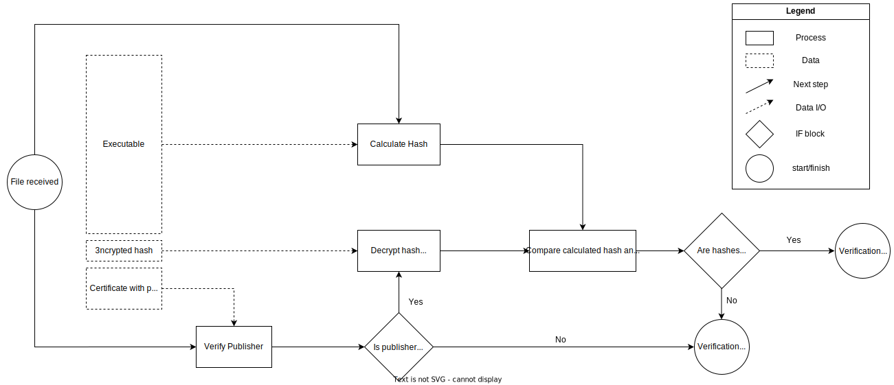
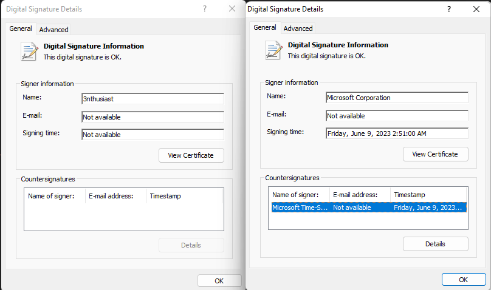

# Practical introduction to the Windows code signing

## Background

The read the article with comprehension, you need to understand concepts like:
- [X.509 Certificate](https://en.wikipedia.org/wiki/X.509)
- [Public Key Infrastructure](https://www1.cs.columbia.edu/~smb/classes/s23/l_pki.pdf)
- [PE format](https://learn.microsoft.com/en-us/windows/win32/debug/pe-format)
- [GPO](https://learn.microsoft.com/en-us/previous-versions/windows/desktop/policy/group-policy-objects)

## What is digital signature?

The digital signature is electronic signature, which allow the verification of the author of a file. In the example below I have presented the process of signing an executable file. 

Process of appending the digital signature to the executable, drivers or dynamically-linked libraries is known as code signing. The code signing process is done by the author / publisher of the file. The flow chart below presents how such process is performed.


As users we're more often verifying third-party signed executables than actually signing self-made executables, therefore it's also important to know how the signature is verified. 

The verification of the digital signature depends on the certificate verification policy. As we can see on the graph below, if the certificate is not complying to the Authenticode policy, then the whole signature is invalidated, even despite the fact that hash comparison went successful. Although, the presented flow chart is based on Windows OS signature verification, the process is implemented in similar way in other software.



After reviewing the graphs some can come up with following questions:

#### **What is Authenticode Policy?**

Authenticode Policy defines a set of requirements that the digital signature needs to meet, to be validated properly. This policy can be altered through Group Policy editor (gpedit.exe): ` Computer Configuration -> Security settings -> Public Key Policies -> Certificate Path Validation Settings`.


#### **Is the hash calculated from the whole file?**

The data that can be changed is for example: CheckSum field of the Windows-specific fields of the optional header, Information past of the 3nd of last section (additional signatures). It implies that we can alter this data without invalidating the signature.

#### **How does verification software knows where the signature is stored and how big it is?**

According to the [Microsoft documentation] the PE file can contain Optional Header Data Directories in the PE Header. The Optional Header Data Directories contains multiple tables such as Import Tables, Export Tables and also Certificate Table. Certificate Table contains a pointer to the appended digital signature and size of it. The signature is always located at the 3nd of the image file.


Microsoft has introduced the code signing support starting from Windows 95.
Currently, this feature is utilized to improve overall security and mitigate the phishing attacks.


## Code signing with self-signed certificate

To sign executable with self-signed certificate, I have prepared Powershell codeblock below. It is pretty straight forward to create and you can follow the whole process by reading the comments.

```
# Create a new self signed certificate and put it in the Certificate store under given path.
$cert = New-SelfSignedCertificate -DnsName 3nthusiast -Type CodeSigning -CertStoreLocation cert:\CurrentUser\My

# Export the certificate to a file. Change a Thumbprint value to the one that you have generated.
Export-Certificate -Cert $cert -FilePath code_signing.crt

# Import certificate as TrustedPublisher. 
Import-Certificate -FilePath .\code_signing.crt -Cert Cert:\CurrentUser\TrustedPublisher

# Import certificate as Root CA. You will be prompt with confirmation that you accept the risk.
Import-Certificate -FilePath .\code_signing.crt -Cert Cert:\CurrentUser\Root

# Signing
Set-AuthenticodeSignature 'test.exe' -Certificate $cert | Select-Object -expandproperty StatusMessage
```

> **_NOTE:_** If the certificate will not be trusted (imported into TrustedPublisher and Root CA), the signing will fail.


## Missing element - timestamp signature

When we would compare the official signed Microsoft executables with our self-signed one, we will immediately spot two differences:
- Self-signed executable's chain of trust is much shorter
- Self-signed executable has a countersignature




> **_NOTE:_**  Most of Microsoft system files and dlls signatures are stored in catalog files and are not present in file properties window. You can learn more here: [Catalog files](https://learn.microsoft.com/en-us/windows-hardware/drivers/install/using-makecat-to-create-a-catalog-file)

Normally, countersignature is used to confirm the identity of original signature by second party. In the code signing however, it serves as an timestamp signature.

Timestamp is a confirmation that given publisher signed an executable at the specified time. The timestamp signatures are issued by timestamp servers. 
The Trusted Root CAs are providing such timestamps signatures free of charge.
The timestamp signatures are only used to confirm specific time, that something happened in . 

What timestamp signatures are used for in code signing? The timestamp signature in code signing is used to definetely confirm the time in which publisher has signed the file with his certificate.  

Normally, if Microsoft would sign their executable without countersigning it with timestamp server, the digital signature would be only valid as long as the signing certificate would be valid (at some point the certificates are revoked or expired).

The solution for that problem are timestamp signatures. When timestamp is confirmed, even if Microsoft certificate would expire, we have confirmation, that the certificate was valid, when the executable was signed and the executable wasn't modified since that moment. 

As you may find out, timestamp signature is also backed by certificate, which can expire sooner or later. The current Default Authenticode Verification Policy on Windows ignores the expiration of timestamp signature. Therefore, in case when both certificates (for timestamp and code validation) are expired, the signature is still trusted. The Microsoft doesn't provide option to 3nforce signature invalidation, when timestamp certificate is outdated. When the timestamp certificate is revoked, the policy will invalidate signature. This behaviour can be changed via GPO.


## Adding timestamp signature


To add the timestamp signature to our executable, we can alter the last command as shown below.

```
# Signing
Set-AuthenticodeSignature 'test.exe' -Certificate $cert -TimestampServer http://timestamp.digicert.com| Select-Object -expandproperty StatusMessage
```

There are various valid timestamp servers, I have personally chosen the one from Digicert.


## Valid signature is important

SOON

## PS

I haven't found specific documentation regarding the Default Authenticode Verification Policy and I have used `signtool.exe` to figure out the rules step by step. Feel free to contact me in case you will find the official docs for it! 